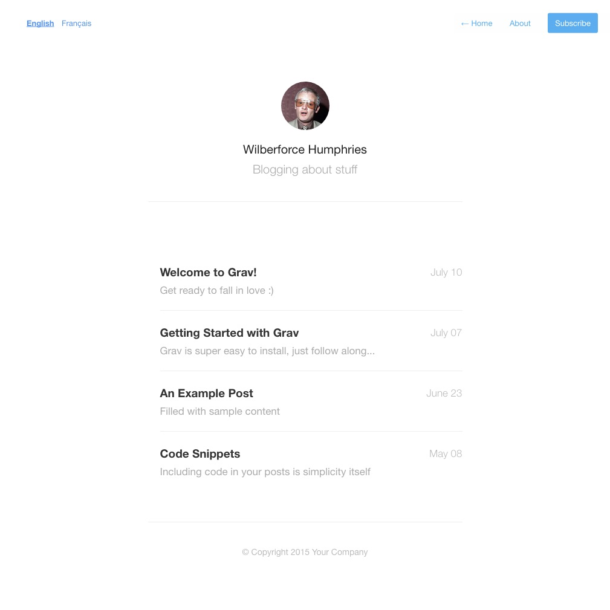

# MultiLang Skeleton for Grav



This Multi-Language skeleton package utilizes the minimal [cacti theme](https://github.com/getgrav/grav-theme-cacti/) and the power of Grav's multi-language capabilities plus a few plugins to provide a solid example of how a site that seamlessly supports multiple languages can work with Grav.

## Features

* Lightweight and minimal for optimal performance
* Infinite loading of blog posts utilizing the [pagination plugin](https://github.com/getgrav/grav-plugin-pagination).
* Multi-Language Compatible!
* Included languages: 
    * English
    * Spanish
    * Czech
    * German
    * Italian
    * Finnish
    * French
    * Dutch
    * Polish
    * Portuguese
    * Romanian
    * Russian
* Super clean and modern design
* Twitter and Facebook integration
* Support for Disqus comments
* Google Analytics built-in

## Basic Setup for a new Grav site

The simplest way to install the MultiLang Skeleton package:

1. [Download MultiLang Skeleton](http://getgrav.org/downloads/skeletons)
2. Simply unzip the package into your web root folder.
3. Point your browser at the folder, job done!

**TIP:** Check out the [general Grav installation instructions](http://learn.getgrav.org/basics/installation) for more details on this process.

---

## Existing Grav site

It is possible to install just the theme, but page content will need to reference the [Cacti theme](https://github.com/getgrav/grav-theme-cacti)'s supported templates.  It is strongly advised to at least install the Cacti Skeleton package to see the theme's capabilities in action.

To install  **just** the theme:

```
$ bin/gpm install cacti
```

