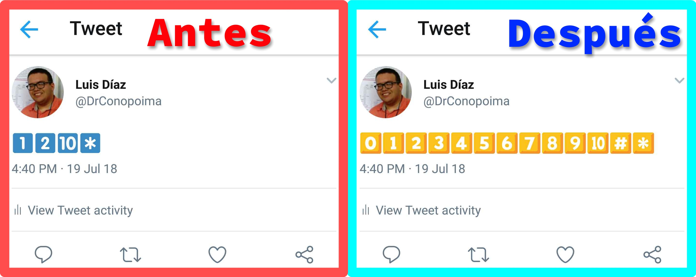

Si has seguido un comentarista deportivo durante un torneo deportivo usando la aplicación Twitter para Android (en mi caso, siguiendo el fútbol con [MisterChip](https://twitter.com/2010MisterChip)), probablemente hayas encontrado un par de veces que algunos tweets no se muestran correctamente cuando usan los emojis numéricos en lugar de caracteres de dígitos de la vieja escuela. El uso de dígitos emoji es una buena práctica de manejo de redes sociales, los números coloreados se destacan y hacen que el tweet sea más visible. El único problema que surge es que los emojis que representan los números del 3 al 9 no son compatibles con la versión estable de la aplicación Twitter para Android (probado a partir de julio de 2018).

<figure class="image-caption"><figcaption class="">En el iPhone (izquierda), se muestran todos los numerales, mientras que hay problemas con los emojis 3-9 en Android (derecha)</figcaption></figure>

Todos los dígitos del teclado se muestran sin problemas en la última aplicación de Twitter para iOS, desde donde el propietario de la cuenta (Alexis) twitea.

<figure class="image-caption"><figcaption class="">La fuente leída por TweetDeck confirma que se envió el tweet desde el iPhone</figcaption></figure>

Mientras que algunos seguidores eran conscientes del problema, ya que la importancia del tweet radica en los números sobresalientes sacados de la competencia, el mensaje se pierde, y algunas personas podrían considerar que Alexis cometió el error.

<figure class="image-caption"><figcaption class="">Un lector deja una respuesta quejándose después de que el tweet original no se muestra correctamente</figcaption>

</figure>

Descubrí que también se me presentaba este problema, así que decidí revisarlo más a fondo hasta encontrar una solución para este problema. No sabía en ese momento cómo llamar a los símbolos de dígitos, así que decidí ver el tweet desde mi escritorio para poder usar la funcionalidad del navegador de Modo de Inspección. Para reproducir mi procedimiento, haga clic derecho mientras tiene el cursor sobre un emoji de un dígito y haga clic en el elemento desplegable 'Inspeccionar elemento'. Esta acción abrió el código de la imagen y dos de las propiedades me dieron una idea de qué buscar:

`aria-label="Emoji: Keycap digit three"`

`title="Keycap digit three"`

Luego necesitaba saber cuál era el soporte para eso en mi versión de Android. Busqué `Android 7.0 Keycap Digit Three`, y en un resultado de Emojipedia parecía que Android tenía soporte completo para los emojis de dígitos de Keycap, pero estos emojis presentados deberían ser amarillos desde [5.0 Marshmallow](https://emojipedia.org/google/android-5.0/) hasta [7.0 Nougat](https://emojipedia.org/google/android-7.0/) (versión de mi dispositivo). Se mostraron emojis azul claro, por lo que la aplicación no estaba usando la biblioteca nativa.

El siguiente paso fue determinar qué biblioteca de íconos usa la aplicación Twitter. Al buscar, encuentro un sitio de noticias que informa que Twitter decidió en mayo de 2018 [cambiar a la biblioteca personalizada de emojis Twemoji en su aplicación Android](https://blog.emojipedia.org/twitter-switches-to-twemoji-on-android/), en un intento de dar paridad de las capacidades emoji a los usuarios de Android. El soporte para Twemoji en Android se remonta a v4.4 Kit Kat. Dado que el problema me sucedió en Android 7.0, ahora podía desactivar Twemoji para intentar resolver este problema, ya que los emojis de dígitos keycap eran nativamente compatibles.

Los pasos para volver a la biblioteca nativa de emoji en la aplicación son los siguientes:

1. Abra la barra lateral haciendo clic en la imagen de su cuenta y vaya a la opción **"Configuración y privacidad"**.
    <figure class="image-caption"><figcaption class="">Paso 1: abra el menú lateral haciendo clic en su imagen y haga clic en «Configuración y privacidad»</figcaption></figure>
2. Haga clic en **"Pantalla y sonido"**
    <figure class="image-caption"><figcaption class="">Paso 2: selecciona la opción «Pantalla y sonido»</figcaption></figure>
3. Deseleccione la opción titulada **"Emoji"**
    <figure class="image-caption"><figcaption class="">Paso 3: encuentre la opción llamada «Emoji» y presione para desmarcar</figcaption></figure>
4. Haz clic en **Reiniciar Twitter** en la ventana para cerrar la aplicación y luego haz clic en la aplicación desde tu lanzador para volver a abrirla.
    <figure class="image-caption"><figcaption class="">Paso 4: Haz clic en el botón «Reiniciar Twitter» para cerrar la aplicación y reabrirla después.</figcaption></figure>

Después de llegar al último paso, deberías poder ver los emojis del teclado en tweets en la aplicación Android. Puedes abrir [este tweet en tu aplicación para probar los resultados de esta solución](https://twitter.com/DrConopoima/status/1019955037399932928). El aspecto real de los emojis puede depender de la versión Android de tu dispositivo y del fabricante (algunos fabricantes implementan sus variates nativas de los íconos).

<figure class="image-caption"><figcaption class="">Se muestra que todos los emojis del teclado numérico se muestran correctamente después de deshabilitar Twemoji</figcaption></figure>

Si utilizas Android 4.4 Kit Kat, es posible que los emojis de dígitos del teclado no estén soportados de forma nativa, a menos que el fabricante de tu teléfono los haya implementado, en cuyo caso el soporte parcial de Twemoji sería mejor que nada. También es posible que algunos dispositivos con versiones más recientes de Android de algunos fabricantes tampoco soporten todos los emojis de forma nativa. Por favor, dame tu opinión si esto funcionó para ti en mi Twitter [@DrConopoima](https://twitter.com/drconopoima).
